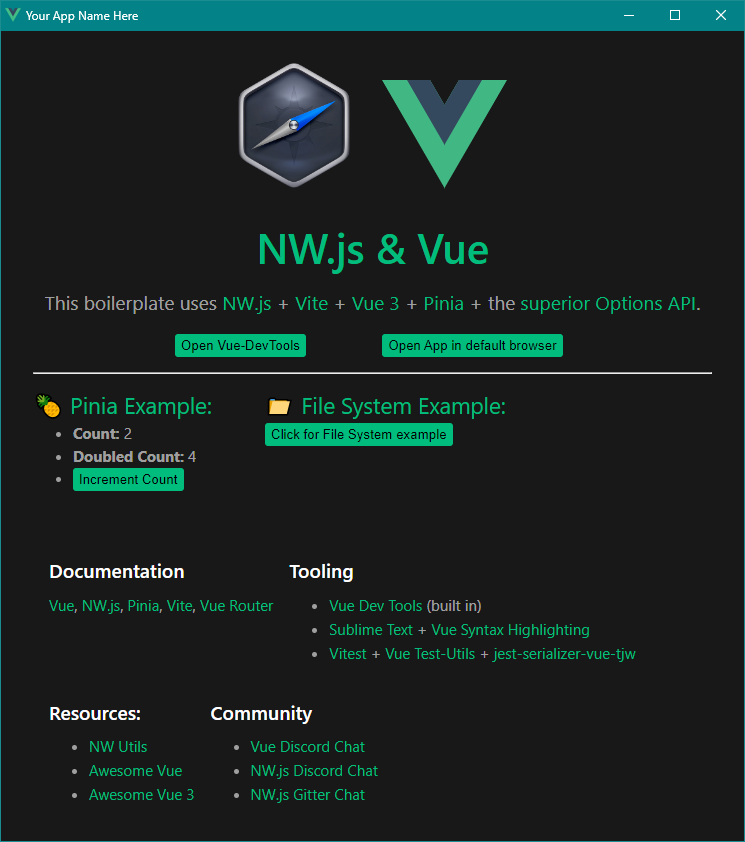

# NW.js + Vue 3 Desktop App Boilerplate

The easiest, quickest, and best option for building Desktop Apps with Vue.

100% test coverage. Vue-DevTools built in.

All you do is `npm install && npm start` and you got a desktop app and web app development environment with Vue-DevTools built-in.

**Does this work for web or just desktop?**

**Both.** This repo will build both for web and desktop and includes a simple `this.isDesktop` flag so you can add desktop specific features that won't show on the web. This repo has 100% test coverage including tests for both web and desktop builds. You could even theoretically add NativeScript-Vue into the mix and build for native mobile as well (though that is not set up in this repo).

Run `npm run build` and you're ready to ship/deploy: Web App, Windows Installer, OSX and Linux apps.




## Technology colophon

* **Vue 3** - Frontend framework
* **NW.js** - Desktop App runtime environment
  * Chromium 119
  * Node.js 20.7.0
* **Vue-DevTools** - Built in to the Chromium dev tools
* **Vite** - Dev Server/Bundler/App build tool
* **Pinia** - Global State Management
* **Vue-Router** - Frontend routing/navigation
* **Options API** - [Component organizational structure](https://user-images.githubusercontent.com/4629794/204181213-6c9bcece-62fb-4790-8fc2-7df546ca7df5.png)
* **Constants Plugin** - Gives you a [dedicated place to store constants](https://github.com/TheJaredWilcurt/vue-options-api-constants-plugin) in a component
* **NW-Builder-Phoenix** - Automated desktop builds
* **ESLint** - Code error prevention and stylistic consistency
  * Vue Linting
  * Accessibility Linting
  * Test Linting
  * Import Linting
* **Vitest** - Vite-based Unit/integration/behavioral testing
  * 100% test coverage examples
  * @vue/test-utils - Test helpers for interacting with Vue in tests
  * jest-serializer-vue-tjw - Dramatically improved snapshot formatting
  * @pinia/testing - Initialize Pinia in tests


## Documentation

In all `.vue` components, you have access to `nw`, `global`, `process`, `require`, and the boolean `isDesktop`:

```js
methods: {
  example: function () {
    if (this.isDesktop) {
      console.log('Your OS is ' + this.process.platform);
      console.log('Your AppData location is ' + this.nw.App.dataPath);
      // Sets a value on Node's global, meaning other windows have access to this data.
      this.global.cow = 'moo';
      // The contents of the current directory
      console.log(this.require('fs').readdirSync('.'));
    }
  }
}
```

Or even directly from the template (with some slight changes to work within the Vue context):
```html
<div v-if="isDesktop">
  Your OS is {{ process.platform }}.
  Your AppData location is {{ nw.App.dataPath }}.
  <button @click="nw.global.cow = 'moo'">
    Clicking this button sets a value on Node's global.
    Meaning other windows have access to this data.
  </button>
  The contents of the current directory are {{ nw.require('fs').readdirSync('.') }}.
</div>
```


## Running locally

1. Download, Fork, or Clone this repo
1. Install [Volta](https://volta.sh)
   * It will handle using the correct Node version based on the `package.json`
1. Run `npm install`
1. Run `npm start`


## Lint

Uses rules in `./eslint.json`

1. `npm run lint` to see linting errors
1. `npm run fix` to auto-fix linting errors (where possible)


## Tests

1. `npm t` runs all unit tests and shows coverage output
1. `npm t -- -u` runs all unit tests, updating snapshots (use with care)


## Building for distribution

1. `npm run build:clean` will delete your `./dist` and `./dist-vue` folders
1. `npm run build:vue` will build just your Vue app for web distribution (`./dist-vue`)
1. `npm run build:nw` will build just your NW.js app (`./dist`) for all supported platforms (Windows, OSX, Linux 32-Bit, Linux 64-Bit)
1. `npm run build` is your all-in-one command. It will clean out the old dist folders and build your Vue and NW.js app


## IMPORTANT NOTE ABOUT BUILDS

They take a long time. If you do `npm run build` expect it to take 10-30 minutes. This can be adjusted by changing the build params in the `package.json`. The more platforms and build types, the longer it takes. You can also remove the `--concurrent` from the `build:nw` script to see a status of what has been completed. This will allow individual pieces to finish faster, but the entire build will take longer.


## Removing Pinia

I set up Pinia in this project to save you time (and because it's amazing). If you don't need global state management for your project, you can remove Pinia by doing the following:

* Delete the `/src/store` folder and its contents
* Delete `/src/views/PiniaDemo.vue`
* Delete `/tests/unit/views/PiniaDemo.test.js`
* Remove the Pinia Demo `RouterLink` from `/src/App.vue`
* Remove import and route object relating to "PiniaDemo" from `/src/router/index.js`
* Remove the lines of code from `/tests/unit/test-helpers.js` that say "pinia"
* Remove the lines of code from `/package.json` that say "pinia"
* `npm install && npm t -- -u`
* `git add -A && git commit -m "Removed Pinia"`


## Updating Vue-DevTools

When you first run `npm install`, you will get the latest stable Vue-DevTools. However, future `npm install`s will not re-download the latest Vue-DevTools.

To update your version of Vue-DevTools run `npm run update:vue-devtools`.

This will delete the existing version and download the latest version of Vue-DevTools, then apply tweaks for it to work in NW.js.


## Alternatives

* [Vue 3 Desktop and Mobile](https://github.com/rigor789/nw-vue3-boilerplate) - Fork of this repo but with NativeScript added to also build for Android and iOS.
* [nw-vue-cli-example](https://github.com/nwutils/nw-vue-cli-example) - Uses Vue-CLI (WebPack), has Vue 2 and Vue 3 branches.
* [nwjs-vue](https://github.com/elegantweb/nwjs-vue) - Uses Vue-CLI 2
* [vue-desktop-basic](https://github.com/TheJaredWilcurt/vue-desktop-basic) - Does not use a build system at all, all `.vue` files run directly in the browser context
* [nw-vue3-typescript-pinia](https://github.com/codeh2o/nw-vue3-typescript-pinia) - Fork of this repo but with TS added


## Boilerplate maintainer notes

This is not for those *using* this repo, but for those *maintaining* it.

1. When updating the version of NW.js devDependency, also update these:
   * `package.json` version, devDeps, build nwVersion, volta
   * `build.target` in `vite.config.js`
   * Update the Chromium/Node version numbers at the top of the README
1. Bump the version number, and all the npm scripts that reference the version number
1. Run `npm run regression` after updating dependencies or other major changes to verify builds still work correctly
